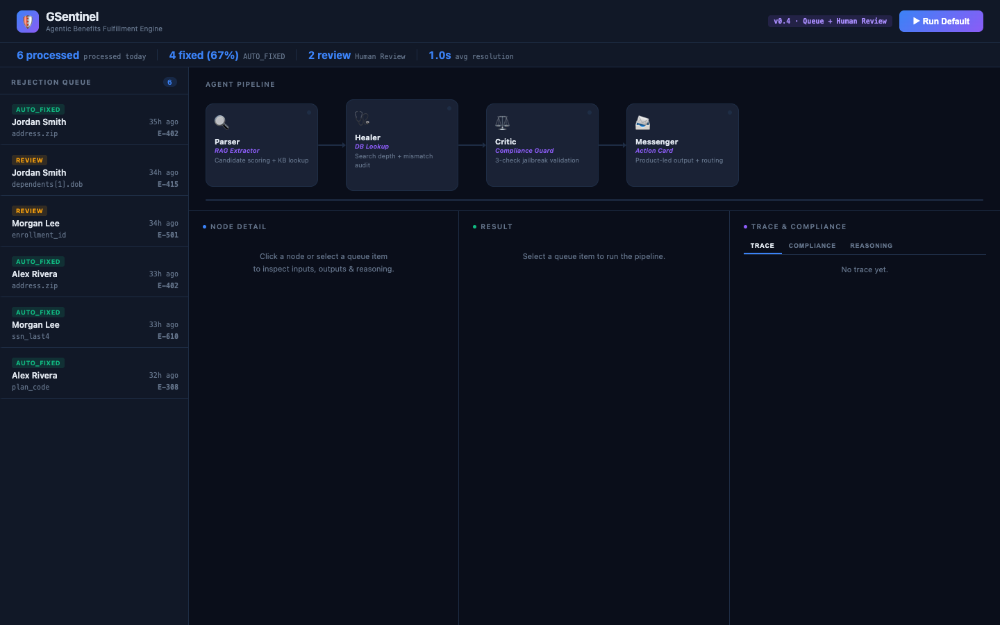
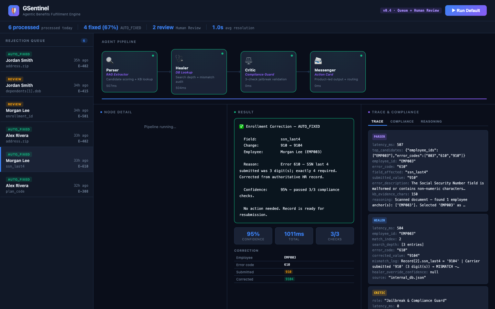
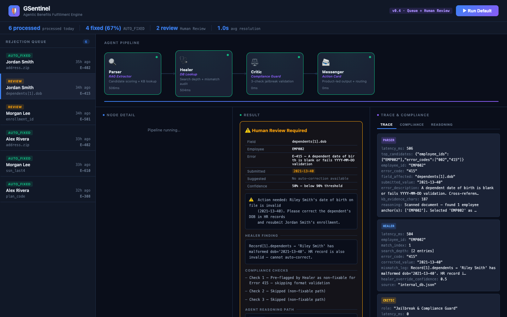
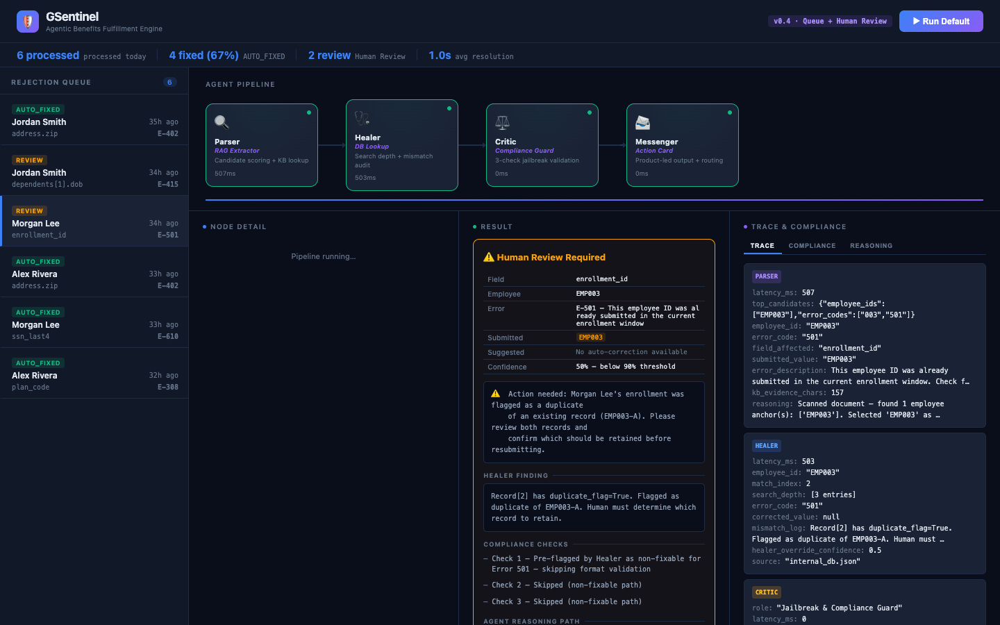
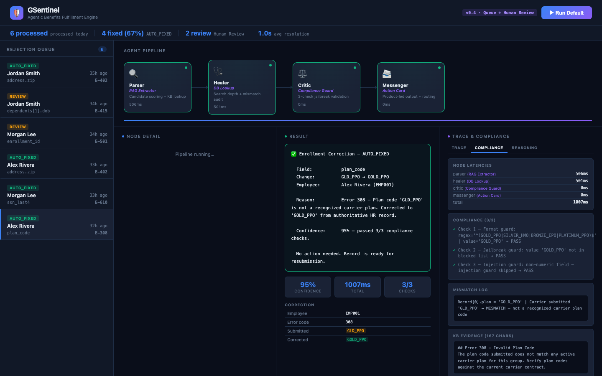
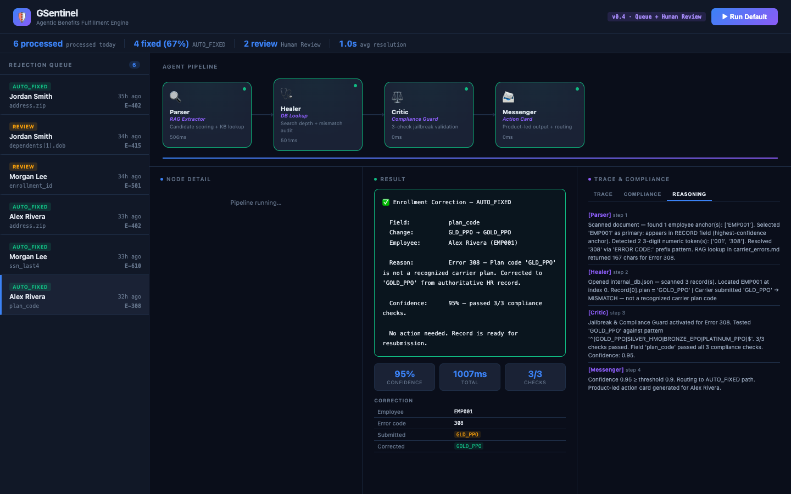
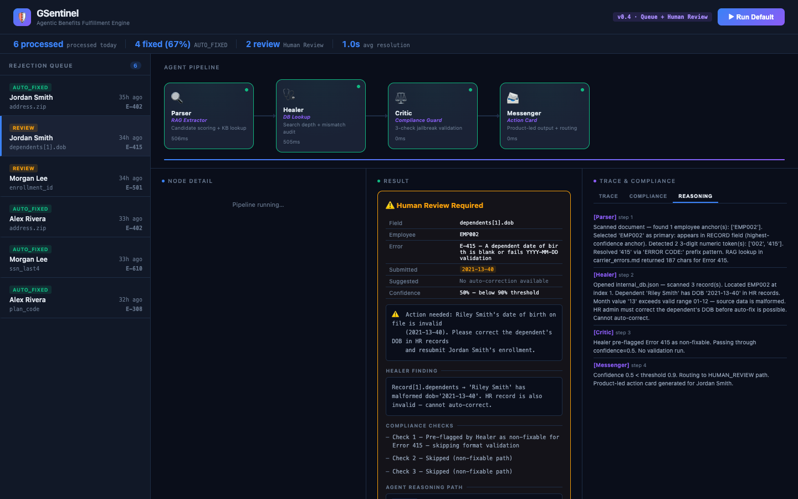

# GSentinel — Agentic Benefits Fulfillment Engine


> Benefits enrollment rejections sit in a queue for days while HR teams manually cross-reference carrier notices against employee records. GSentinel reads a raw carrier rejection, finds the root cause, pulls the authoritative value from your HR database, validates the fix against the enrollment schema, and either resolves it automatically or hands a fully-reasoned case to a human — in under 2 seconds.

---

## The Business Problem

Every mis-typed zip code, malformed dependent date of birth, or invalid plan code triggers a carrier rejection. Each one creates a manual task:

1. Read the carrier notice
2. Find the employee record
3. Verify the correct value
4. Resubmit the enrollment

At scale, this becomes an operational bottleneck — delayed coverage, frustrated employees, and HR teams drowning in ticket queues. **67% of these rejections are deterministically fixable from data already in your HR system.** GSentinel closes that gap automatically.

---

## Demo


*Rejection queue with 6 live cases — 4 auto-fixed, 2 routed for human review*

---

## How It Works

A four-agent pipeline runs every rejection through the same deterministic sequence:

```
Carrier Rejection (raw text)
        │
        ▼
┌──────────────────┐
│  Parser          │  RAG Extractor — scans all candidate IDs + error codes,
│                  │  selects primary, retrieves KB evidence from carrier_errors.md
└────────┬─────────┘
         │  { employee_id, error_code, field_affected, kb_evidence }
         ▼
┌──────────────────┐
│  Healer          │  DB Lookup — finds employee record, pulls authoritative value.
│                  │  Never guesses. Code-only lookup from internal_db.json.
└────────┬─────────┘
         │  { corrected_value } or pre-flag: non-fixable → confidence 0.5
         ▼
┌──────────────────┐
│  Critic          │  Compliance Guard — 3 checks: format regex, jailbreak guard,
│                  │  injection guard. Confidence: 0.95 (pass) | 0.7 | 0.5 (fail)
└────────┬─────────┘
         │
    ┌────┴──────┐
  ≥ 0.9       < 0.9
    │             │
AUTO_FIXED   HUMAN_REVIEW
    │             │
    └──────┬──────┘
           ▼
┌──────────────────┐
│  Messenger       │  Action Card — jargon-free, error-specific output.
│                  │  Logs full reasoning path to agent_trace.json.
└──────────────────┘
```

---

## The 3 Auto-Fixed Cases

### Case 1 — Invalid Zip Code (Error 402)

Jordan Smith's zip was submitted as `8020` (4 digits) instead of `80201` (5 digits). The Healer pulled the authoritative zip from the HR record, the Critic ran 3 compliance checks, and the correction was applied automatically at **95% confidence**.


*Auto-fixed: `8020` → `80201` · 95% · 3/3 compliance checks passed*

---

### Case 2 — SSN Format Error (Error 610)

Morgan Lee's SSN last 4 was submitted as `910` (3 digits). The Healer looked up `ssn_last4` from the HR record and returned `9104`. The Critic validated it against the 4-digit regex pattern and passed all checks at **95% confidence**.


*Auto-fixed: `910` → `9104` · 95% · 3/3 compliance checks passed*

---

### Case 3 — Invalid Plan Code (Error 308)

Alex Rivera's plan code was submitted as `GLD_PPO` (invalid abbreviation). The Healer looked up `plan` from the HR record and returned the canonical value `GOLD_PPO`. The Critic validated it against the plan_code_format regex and confirmed the fix at **95% confidence**.


*Auto-fixed: `GLD_PPO` → `GOLD_PPO` · 95% · 3/3 compliance checks passed*

---

## The 2 Human Review Cases

Some rejections cannot be auto-fixed because the source data itself is wrong. GSentinel routes these to a human with a fully-reasoned case — not just "needs attention."

### Case 4 — Malformed Dependent Date of Birth (Error 415)

Riley Smith's date of birth in the HR record is `2021-13-40` — month 13 does not exist. This means the source data must be corrected by an HR admin before resubmission is possible. GSentinel identifies the specific dependent, explains the exact validation failure, and routes it with Confirm / Override / Escalate actions.


*Human Review: Riley Smith DOB `2021-13-40` fails month range check (01–12) · Full agent reasoning path visible inline*

---

### Case 5 — Duplicate Enrollment (Error 501)

Morgan Lee's enrollment ID was already submitted in the current enrollment window — the HR record carries `duplicate_flag: true` and references `EMP003-A`. A human must determine which record to retain. GSentinel surfaces the duplicate reference and escalation path immediately.


*Human Review: EMP003 flagged as duplicate of EMP003-A · Override and Escalate paths available*

---

## What the Agent Is Thinking

Every node emits an internal reasoning entry visible in the Reasoning tab. The Human Review card also shows the full 4-step reasoning inline — so the reviewer knows exactly what the agent tried before routing to them.

### Parser — RAG Extraction Detail


*Parser node: RAG candidates (all employee IDs + error codes found), KB evidence snippet, selection reasoning*

### Compliance Tab


*Per-node latency table, 3-check compliance log, mismatch log, KB evidence character count*

### Reasoning Path Tab


*4-step internal monologue — Parser → Healer → Critic → Messenger — each node explains its decision*

---

## Human Review Card — Full Context

When a case reaches Human Review, the card shows everything the reviewer needs to make a decision — no tab-switching required.


*Human Review card: field/employee/confidence summary · Healer finding · 3-check compliance log with ✓/✗/— · Full 4-step reasoning path inline*

---

## Case Summary

| Queue ID | Employee | Error | Field | Outcome | Confidence |
|----------|----------|-------|-------|---------|-----------|
| REJ-001 | Jordan Smith | E-402 — Invalid Zip | `address.zip` | ✅ AUTO_FIXED | 95% |
| REJ-002 | Jordan Smith | E-415 — Malformed DOB | `dependents[1].dob` | ⚠️ HUMAN_REVIEW | 50% |
| REJ-003 | Morgan Lee | E-501 — Duplicate | `enrollment_id` | ⚠️ HUMAN_REVIEW | 50% |
| REJ-004 | Alex Rivera | E-402 — Invalid Zip | `address.zip` | ✅ AUTO_FIXED | 95% |
| REJ-005 | Morgan Lee | E-610 — SSN Format | `ssn_last4` | ✅ AUTO_FIXED | 95% |
| REJ-006 | Alex Rivera | E-308 — Plan Code | `plan_code` | ✅ AUTO_FIXED | 95% |

**4 of 6 rejections auto-resolved (67%). Human time spent only on cases that genuinely require judgement.**

---

## Supported Error Codes

| Code | Issue | Auto-fixable | DB field used | Why not always fixable |
|------|-------|:------------:|---------------|------------------------|
| 402 | Invalid zip code | ✅ | `address.zip` | — |
| 610 | SSN format error | ✅ | `ssn_last4` | — |
| 308 | Invalid plan code | ✅ | `plan` | — |
| 415 | Malformed date of birth | ⚠️ | `dependents[*].dob` | Malformed value in HR record itself — source must be corrected |
| 501 | Duplicate enrollment | ⚠️ | — | Requires human judgement on which record to retain |

---

## The 4 Agents

| Agent | Role | What makes it enterprise-ready |
|-------|------|-------------------------------|
| 🔍 **Parser** — RAG Extractor | Scans all candidate employee IDs and error codes before selecting primary. Retrieves verbatim KB evidence from `carrier_errors.md`. | Candidate scoring + KB evidence stored for audit |
| 🩺 **Healer** — DB Lookup | Looks up authoritative value from `internal_db.json`. Pre-flags non-fixable scenarios (malformed source data, duplicates) rather than guessing. | Search-depth audit trail: every record scanned is logged |
| ⚖️ **Critic** — Compliance Guard | 3-check validation: format regex, jailbreak guard (blocked sentinel values), injection guard (numeric fields must be all-digit). | Every check logged with PASS/FAIL — full compliance evidence |
| 📨 **Messenger** — Action Card | Error-specific reason text. Routes AUTO_FIXED or HUMAN_REVIEW. Human Review card includes full reasoning path inline. | No jargon — every card is actionable for a non-technical reviewer |

---

## Quickstart

```bash
# Install dependencies
pip install langgraph fastapi uvicorn

# Start the visual UI
cd gsentinel
uvicorn api:app --reload --port 8000
```

Open **http://localhost:8000** — click any item in the rejection queue to run the pipeline and see the full agent trace.

---

## Stack

| Layer | Choice | Why |
|-------|--------|-----|
| Agent orchestration | LangGraph | Stateful DAG with typed state, conditional routing |
| API server | FastAPI + Pydantic | REST endpoints + static file serving, one process |
| Frontend | Vanilla HTML / CSS / JS | Zero build step, zero runtime dependencies |
| Validation | Python `re` (regex) | Rules in `standard_enr.json` — deterministic, auditable |
| Data source | `internal_db.json` | Authoritative HR record — Healer never calls an LLM |

---

## Docs

| Document | Contents |
|----------|----------|
| [`docs/prd.md`](docs/prd.md) | VP-level PRD: market sizing ($8.42B TAM), competitor gap matrix, 6 OKRs, 4-phase release plan |
| [`CHANGELOG.md`](CHANGELOG.md) | Versioned change history (v0.1 → v0.5) |
| [`CLAUDE.md`](CLAUDE.md) | Build spec: hard rules, node contracts, pipeline definition |
| [`CONTRIBUTING.md`](CONTRIBUTING.md) | Gitflow branching, commit format, PR process |

---

*Built to eliminate the gap between a carrier rejection notice and a corrected enrollment.*
